# SOC Home Lab: Detection Engineering & SOAR Automation Pipeline

An end-to-end Security Operations Center lab simulating a realistic enterprise detection and response pipeline — from raw Windows AD telemetry, through custom SIEM detection logic, to automated multi-source enrichment and analyst-facing Slack workflows.

This lab demonstrates the full alert lifecycle: **detect → enrich → triage → respond**.

.jpg)

## Table of Contents

- [Environment Setup](#environment-setup)
- [Test Identity & Attacker Simulation](#test-identity--attacker-simulation)
- [Detection Engineering](#detection-engineering)
- [SOAR Enrichment Pipeline](#soar-enrichment-pipeline)
- [Analyst Workflow (Slack Integration)](#analyst-workflow-slack-integration)
- [Staged HIGH-Verdict Demo](#staged-high-verdict-demo)
- [Key Engineering Decisions](#key-engineering-decisions)
- [Skills Demonstrated](#skills-demonstrated)
- [Lessons Learned](#lessons-learned)

---

## Environment Setup

Three Vultr VMs form the lab backbone: a Domain Controller, a Test Machine (domain-joined client), and a dedicated Wazuh SIEM server — all in the same region, with role-separated firewall groups controlling inter-VM access.

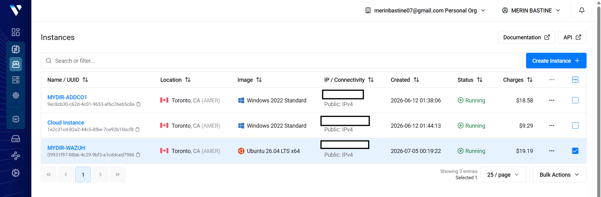
*Three running Vultr instances: `MYDIR-ADDC01` (Domain Controller), `Cloud Instance` (Test Machine), and `MYDIR-WAZUH` (Ubuntu 22.04 SIEM).*

Firewall groups are scoped per VM role rather than shared, restricting each host to only the ports/sources it actually needs:

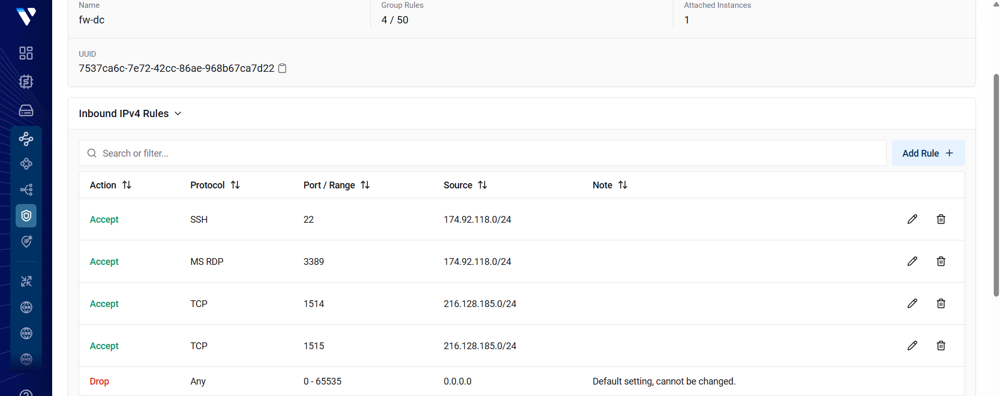
*`fw-dc`: SSH (22) and RDP (3389) scoped to the admin subnet; Wazuh agent ports 1514/1515 scoped to the Wazuh subnet.*

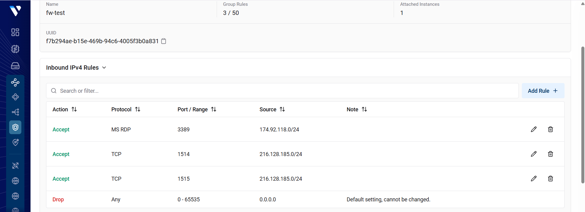
*`fw-test`: RDP (3389) scoped to admin subnet; Wazuh agent ports 1514/1515 scoped to the Wazuh subnet.*

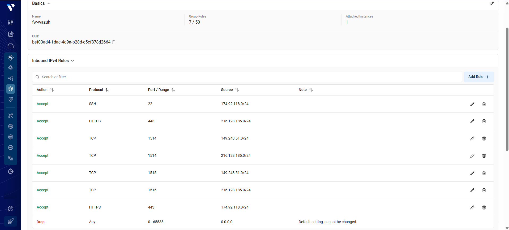
*`fw-wazuh`: SSH, HTTPS (dashboard), and agent listener ports (1514/1515) each scoped to their respective source subnets.*

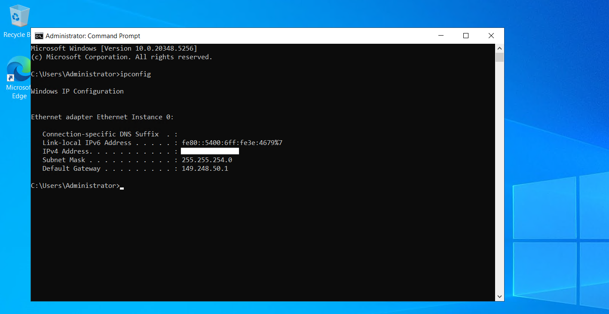
*`ipconfig` on the Domain Controller confirming domain network placement.*

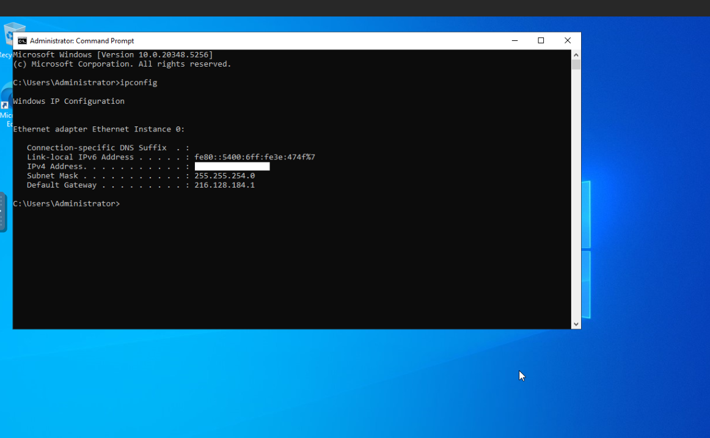
*`ipconfig` on the Test Machine, on a separate gateway/subnet from the DC — used to validate cross-subnet detection logic.*

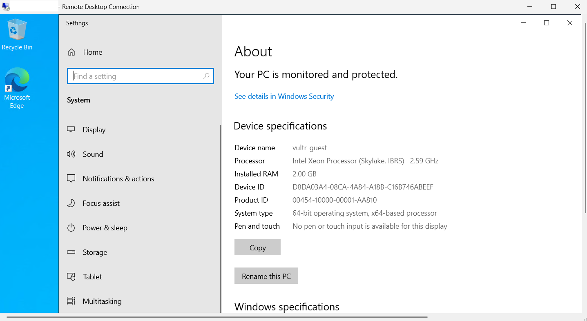
*Test Machine renamed and domain-joined prior to Wazuh agent installation.*

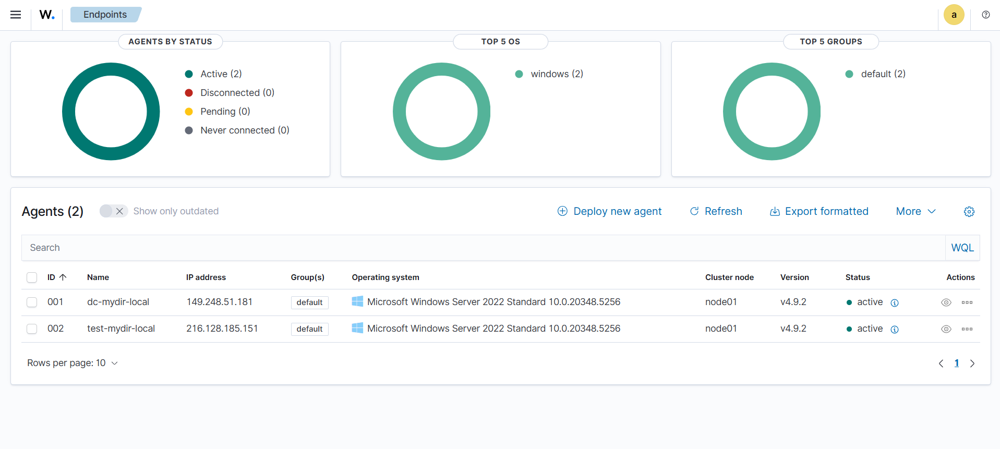
*Wazuh Endpoints dashboard showing both the DC (`dc-mydir-local`) and Test Machine (`test-mydir-local`) agents active and reporting.*

---

## Test Identity & Attacker Simulation

To generate realistic authentication telemetry, a standard AD user (`JSmith`) was created and used to simulate both legitimate console access and external RDP-style authentication.

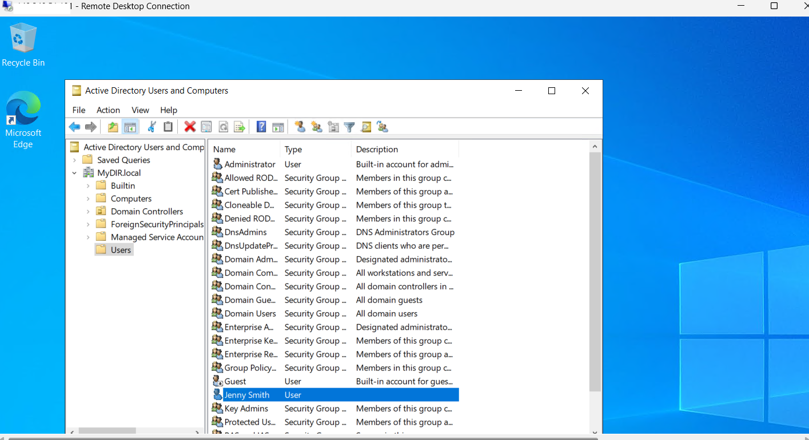
*`Jenny Smith` (JSmith) created in Active Directory Users and Computers under `MyDIR.local`.*

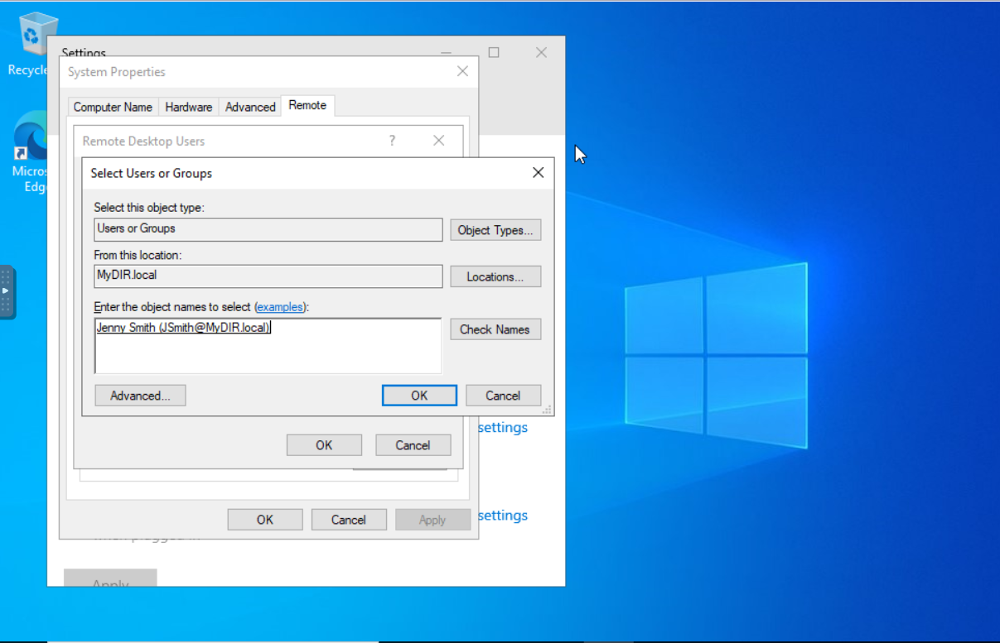
*JSmith added to the Remote Desktop Users group to permit RDP-based sign-in testing.*

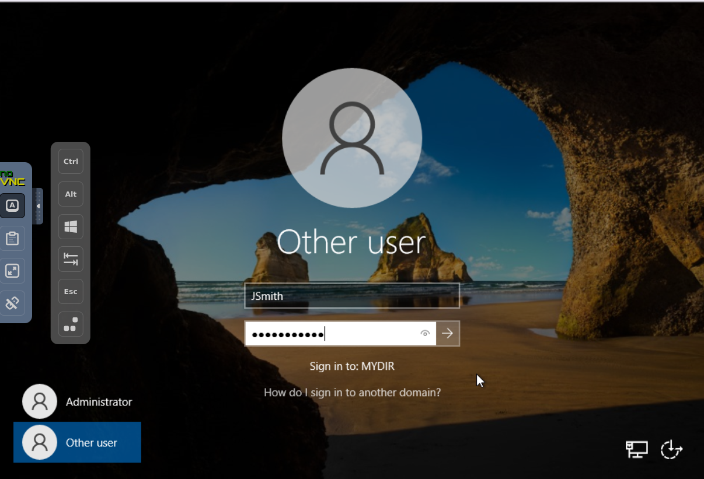
*JSmith signing in via console (noVNC) — this path was later found to produce Logon Type 2, not the RDP-associated Logon Type 10 originally expected.*

---

## Detection Engineering

### Diagnostic Finding: Logon Type Behavior Is Environment-Dependent

Before finalizing the detection rule, authentication events were inspected directly in Wazuh's Discover view to understand what Logon Type Vultr's infrastructure actually produces for different access paths.

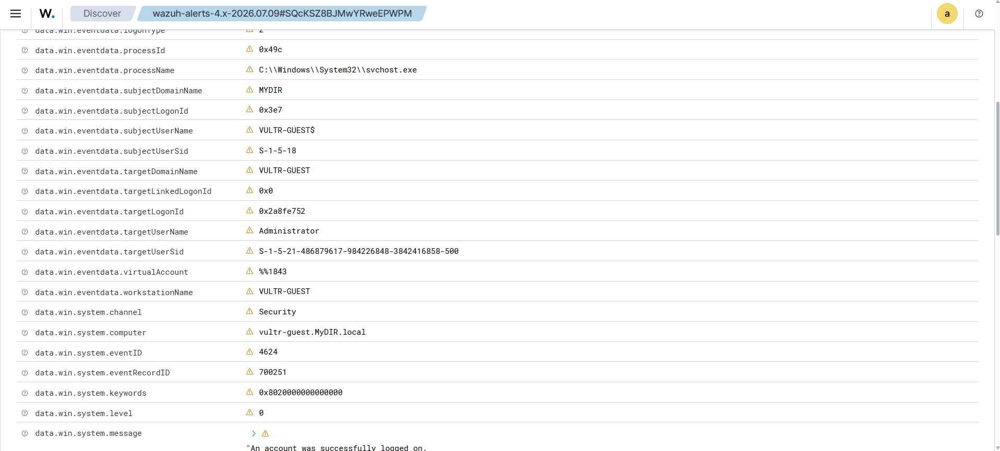
*Raw Event ID 4624 data showing `logonType: 2` for a console-based (noVNC) sign-in — confirming console access does **not** produce the RemoteInteractive (Type 10) logon type textbook RDP documentation would suggest.*

This finding directly shaped the detection rule: genuine external `mstsc` RDP connections were confirmed to produce **Logon Type 3** on this infrastructure, so the rule was built around that observed behavior instead.

### Custom Rule 100100 — Suspicious External RDP-Style Authentication

- **Rule ID:** `100100` (level 10)
- **Base event:** Windows Event ID `4624`
- Chained off Wazuh's parent rule `92657` via `<if_sid>`
- Filters on `authenticationPackageName: NTLM` and `logonType: 3`
- Excludes RFC1918 private ranges using flattened `OS_Regex` alternatives (grouped alternation patterns are unsupported by Wazuh's regex engine)

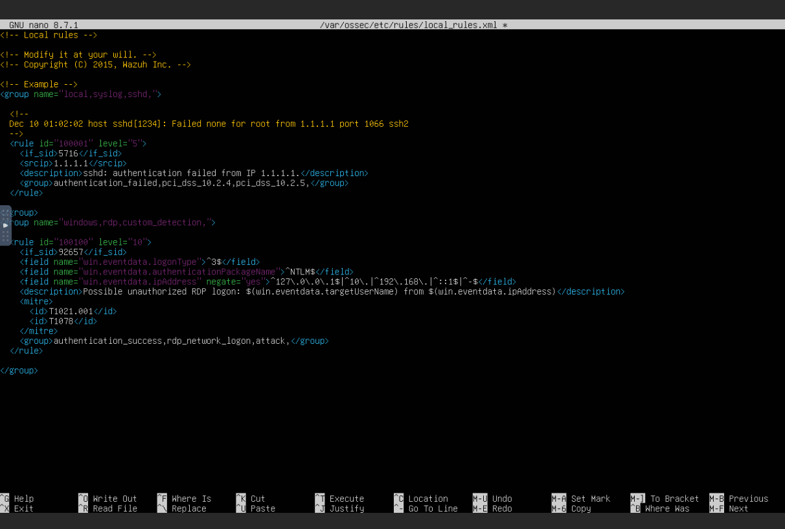
*`local_rules.xml` — rule 100100 chained on parent rule 92657, filtering on Logon Type 3 + NTLM, excluding private IP ranges, and mapped to MITRE ATT&CK T1021.001 / T1078.*

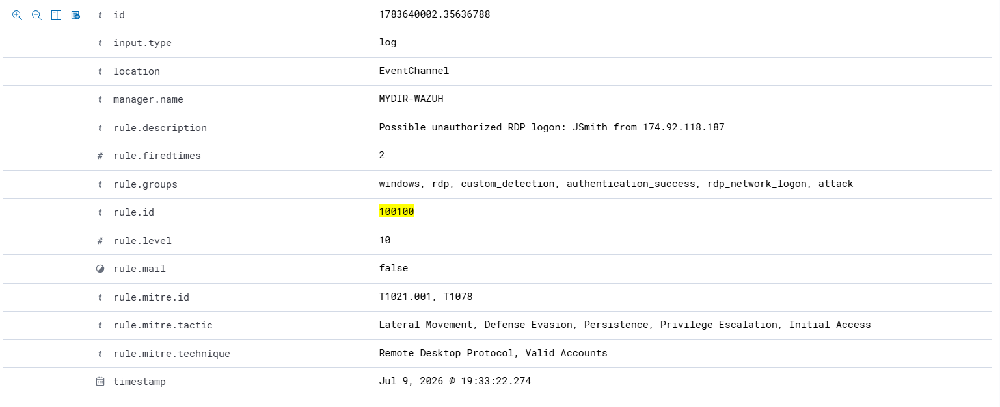
*Rule 100100 firing at level 10: "Possible unauthorized RDP logon: JSmith from 174.92.118.187" — MITRE tactics Lateral Movement, Defense Evasion, Persistence, Privilege Escalation, and Initial Access.*

### Stateful Brute-Force / Credential-Stuffing Detection (In Progress)

- **Base event:** Windows Event ID `4625` (failed logon)
- **Threshold:** ≥5 failures within a 5-second sliding window
- **Privileged account handling:** Cross-reference source account against privileged AD groups via LDAP; flagged accounts trigger auto-lockout
- **Response:** Slack alert with source IP and event detail

Implementation is a standalone Python service (LDAP-based privilege/lockout logic doesn't fit cleanly into a native Wazuh rule) incorporating an Event Log parser, sliding-window threshold tracker, and Slack webhook notifier. Development was in progress at time of writing.

---

## SOAR Enrichment Pipeline

Wazuh forwards filtered alerts to Tines via a custom integration script (`/var/ossec/integrations/custom-tines`) invoked by `wazuh-integratord`, which POSTs the alert as JSON to a Tines webhook.

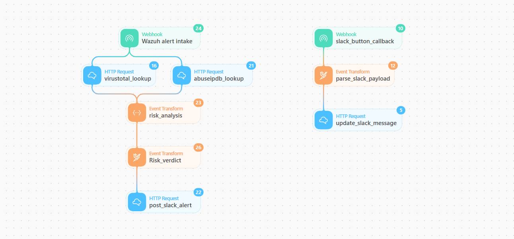
*Complete Tines Story: `Wazuh alert intake` webhook fans out to parallel `virustotal_lookup` and `abuseipdb_lookup` actions, which feed into `risk_analysis` → `Risk_verdict` (AI) → `post_slack_alert`. A separate branch handles the Slack "Take Alert" callback: `slack_button_callback` → `parse_slack_payload` → `update_slack_message`.*

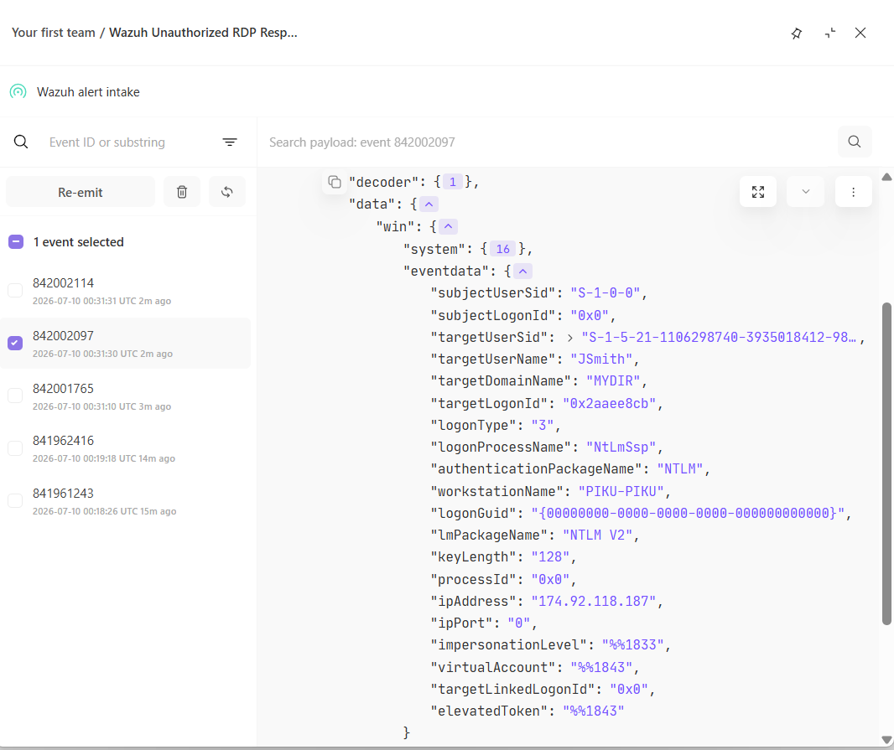
*Raw Windows event data received by the `Wazuh alert intake` webhook — full `eventdata` block including `logonType: 3`, `authenticationPackageName: NTLM`, and source `ipAddress`.*

### Parallel Enrichment

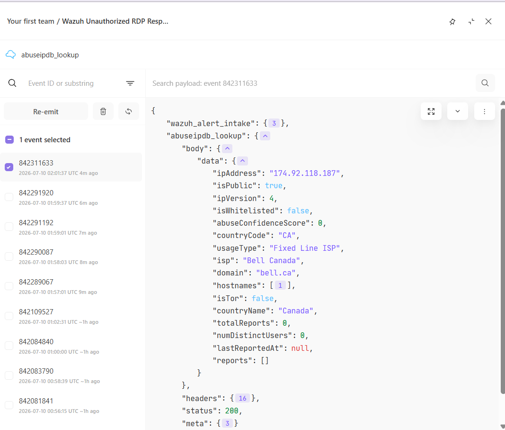
*`abuseipdb_lookup` response: abuse confidence score, ISP, country, and Tor status for the source IP.*

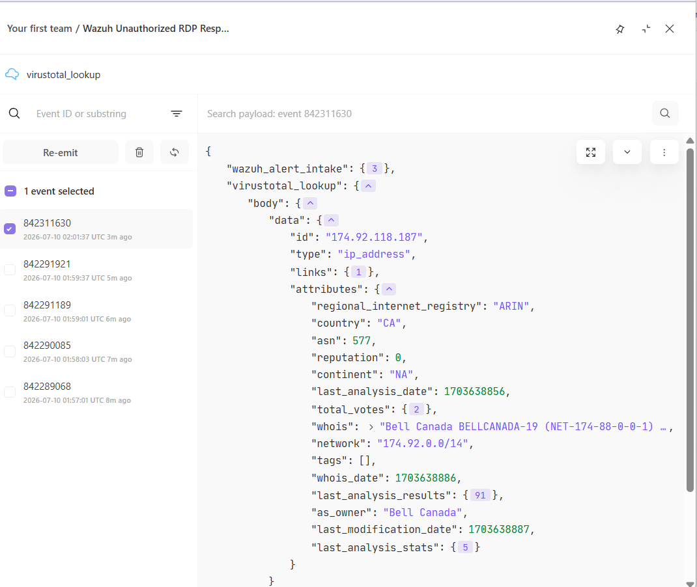
*`virustotal_lookup` response: WHOIS, ASN, reputation, and vendor analysis results for the source IP.*

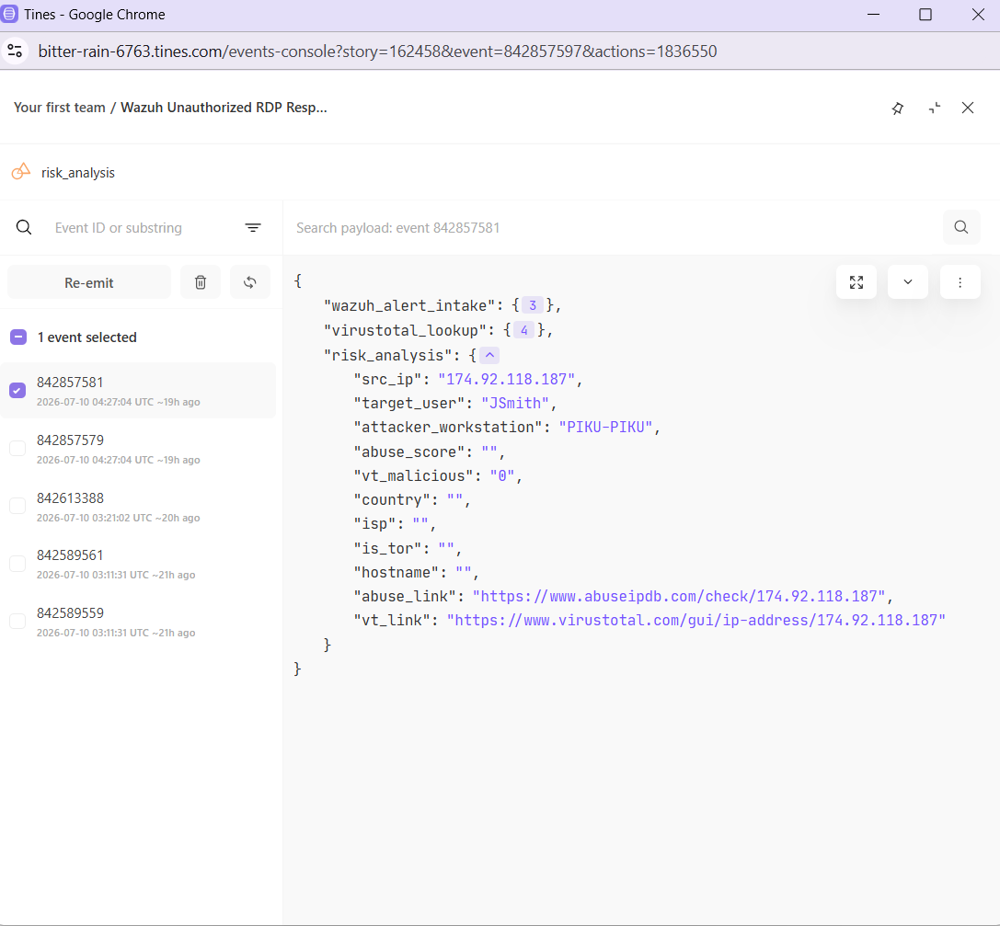
*`risk_analysis` Event Transform consolidating enrichment fields (`abuse_score`, `vt_malicious`, `country`, `isp`, `is_tor`, `hostname`) into a single normalized object ahead of the AI verdict step.*

### AI Risk Verdict

A Tines **Automatic Mode AI action** (`risk_verdict`) synthesizes AbuseIPDB confidence, VirusTotal malicious vendor count, Tor exit detection, and ISP/country context into a final, auditable verdict. Scoring constraints (e.g., **Tor exit = automatic HIGH override**) are embedded directly in the action's Guidance prompt rather than left to open-ended model judgment.

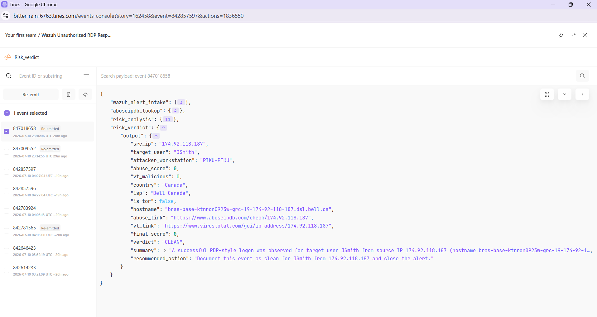
*`risk_verdict` output for a legitimate internal-style login: `final_score: 0`, `verdict: CLEAN`, with a human-readable summary and recommended action ("Document this event as clean... and close the alert").*

---

## Analyst Workflow (Slack Integration)

Enriched, scored alerts are posted to `#soc-alerts` as interactive **Block Kit** messages via `chat.postMessage`.

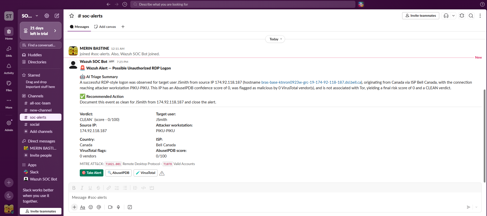
*Wazuh SOC Bot posting the AI triage summary to `#soc-alerts`: verdict, score, target user, attacker workstation, IP context, MITRE ATT&CK tags, and `Take Alert` / `AbuseIPDB` / `VirusTotal` action buttons.*

### Claim Workflow

1. Analyst clicks **🎯 Take Alert**
2. Button opens the Wazuh dashboard for full alert context
3. Callback fires to a second Tines webhook

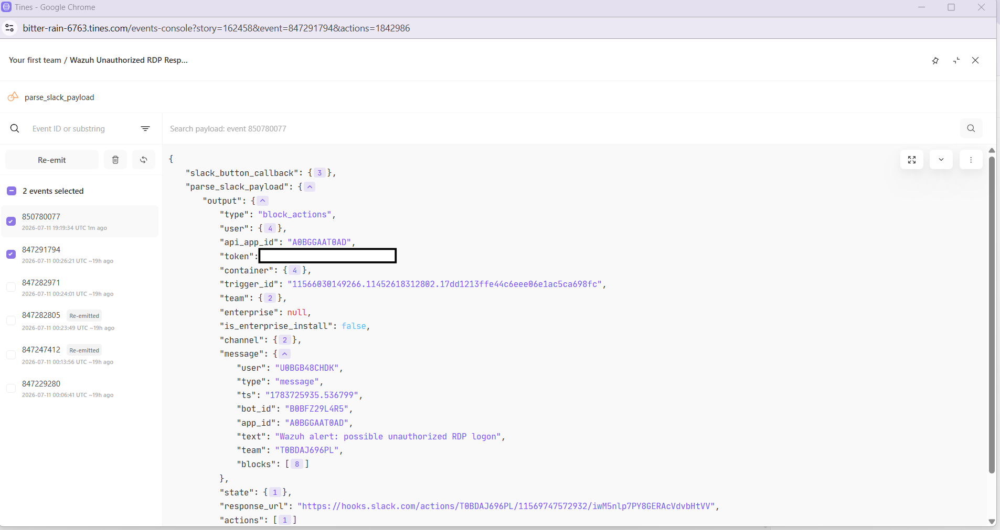
*`parse_slack_payload` — Slack's `application/x-www-form-urlencoded` interactivity payload parsed via an Automatic Event Transform (AI mode), extracting `channel`, `message.ts`, `trigger_id`, and `response_url` after standard Liquid filters failed to reliably parse this payload shape.*

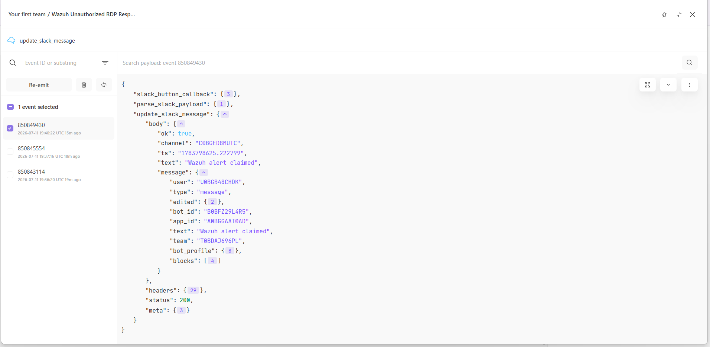
*`update_slack_message` node calling `chat.update` with the parsed `channel` and `ts`, rewriting the message text to "Wazuh alert claimed" — response confirms `"ok": true`.*

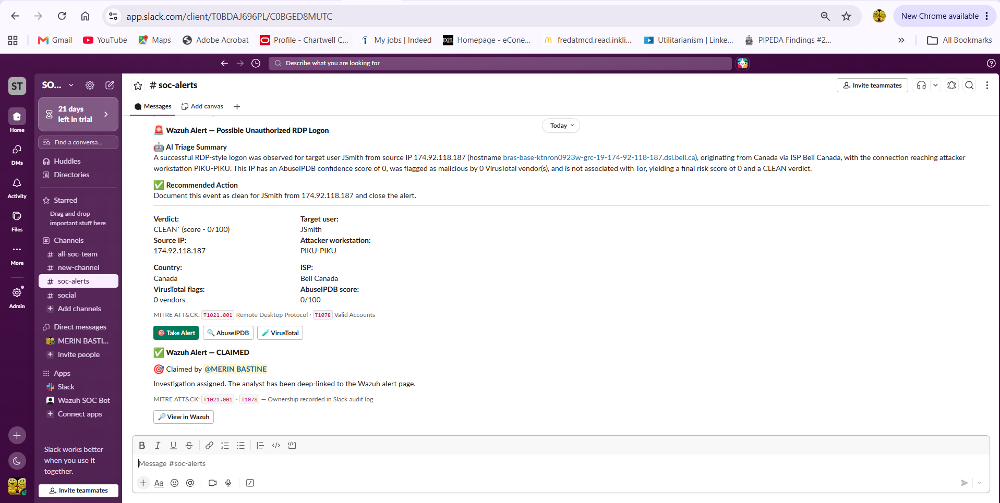
*Original Slack alert updated in place to show "✅ Wazuh Alert — CLAIMED", with ownership attributed to the claiming analyst and MITRE tags retained for audit continuity.*

---

## Staged HIGH-Verdict Demo

To demonstrate the pipeline's behavior on genuinely malicious traffic (rather than only benign residential IPs), a HIGH-severity scenario was staged by POSTing a hand-crafted payload simulating a Tor-associated source IP with VirusTotal detections.

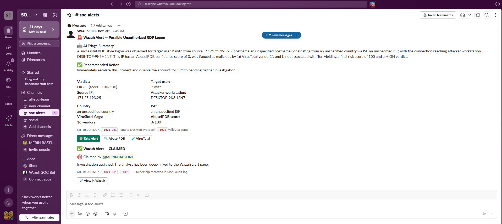
*Staged alert showing the pipeline correctly escalating: `final_score: 100`, `verdict: HIGH`, 16 VirusTotal vendor detections, and a recommended action to "immediately escalate this incident and disable the account pending further investigation" — demonstrating the Tor-exit HIGH-override rule embedded in the AI verdict guidance.*

---

## Key Engineering Decisions

- **Splunk → Wazuh migration:** Splunk Free's licensing model made persistent search unworkable at lab scale; Wazuh 4.9 provided equivalent detection capability without licensing friction.
- **Shuffle → Tines migration:** Shuffle was evaluated first but rejected due to reliability issues in workflow execution; Tines Community Edition proved more stable for this use case.
- **OS_Regex limitations:** Wazuh's `OS_Regex` engine does not support grouped alternation patterns (e.g., `(1[6-9]|2[0-9]|3[01])`). IP-range exclusion patterns had to be flattened into individually-anchored alternatives.
- **Logon type behavior is environment-dependent:** Console access (noVNC) and RDP client access (mstsc) produced different Windows logon type subtypes on identical infrastructure — Type 2 vs. Type 3, not the textbook Type 10 — directly shaping the final detection rule logic.
- **VirusTotal 404 handling:** Residential/unscored IPs commonly return 404 from VirusTotal; the enrichment flow was explicitly designed to fail open rather than block the pipeline.
- **Slack payload parsing:** Standard Liquid-based JSON parsing in Tines failed on the `application/x-www-form-urlencoded` interactivity payload; an AI-based Automatic Event Transform was used as a reliable fallback.
- **Firewall role separation:** Each VM type got its own firewall group (`fw-dc`, `fw-test`, `fw-wazuh`) instead of a shared rule set, for tighter, auditable access control.

---

## Skills Demonstrated

This project is designed to speak directly to SOC Analyst competencies:

- **Detection engineering:** Writing, testing, and iterating custom SIEM correlation rules against real (not simulated-log) authentication events; mapping detections to MITRE ATT&CK (T1021.001 — Remote Services: RDP, T1078 — Valid Accounts)
- **Alert triage & enrichment:** Building multi-source threat intelligence enrichment (AbuseIPDB, VirusTotal) with resilient, fail-open design
- **SOAR / workflow automation:** Designing an end-to-end automated response pipeline from raw alert to analyst-actionable Slack message
- **Analyst workflow design:** Building a claim/ownership mechanism to prevent alert duplication and support accountability — a real SOC operational concern
- **Infrastructure & access control:** Role-separated firewall design across a multi-VM AD + SIEM environment
- **Troubleshooting under ambiguity:** Diagnosing environment-specific Windows logon type behavior rather than relying on textbook assumptions
- **AI-assisted triage:** Constraining an LLM-based verdict engine with explicit, auditable scoring rules rather than open-ended judgment

---

## Lessons Learned

- Free-tier SIEM licensing models can silently break lab usability at scale — validate persistent search/retention limits before committing to a platform.
- SOAR platform reliability matters as much as feature set; evaluate under realistic failure conditions, not just happy-path workflows.
- Detection logic should be validated against *observed* environment behavior, not just documented defaults — logon type mapping is a clear example here.
- Enrichment pipelines touching third-party APIs need explicit failure-mode design (fail-open vs. fail-closed) as a first-class decision, not an afterthought.
- Embedding explicit constraints in AI-driven decision logic (vs. trusting model judgment alone) produces more consistent, defensible, and auditable outputs — an important consideration as SOAR platforms increasingly incorporate LLM-based actions.

---

## Repository Structure

```
.
├── README.md
├── detection-rules/
│   └── local_rules.xml          # Rule 100100 + brute-force rule (WIP)
├── integrations/
│   └── custom-tines             # Wazuh integrator script
├── tines-story/
│   └── story-export.json
└── screenshots/
    ├── SS1.png
    ├── ss2_fwdc.png
    ├── ss2_2fwtest.png
    ├── ss2_3fwwazuh.png
    ├── ss3ad_ipconfig.png
    ├── SS4_testmachinecloudinstance.png
    ├── ss5_jsmith_userac.png
    ├── ss6_renaming_pc.png
    ├── ss7_Jsmith_login.png
    ├── ss8_jsmith_domain_addition.png
    ├── ss9_wazuhagent_addition.png
    ├── ss10wazuhalertpayload.png
    ├── ss11_wazuh_unauthorized_login_rule.png
    ├── ss12_fired_event.png
    ├── ss13_Tines_webhook_result.png
    ├── ss14_AbuseIpdb_webhook.png
    ├── ss15_virustotal_webhook.png
    ├── ss16_risk_analysis_webhook.png
    ├── ss17_risk_verdict_webhook.png
    ├── ss18_slackmessage.png
    ├── ss19_slack_click_parsed_payload.png
    ├── ss20_final_node_payload.png
    ├── ss21_Final_action_after_take_it.png
    ├── ss22_Final_action_from_tor_IP.png
    └── ss23_Whole_tines_workflow.png
```
